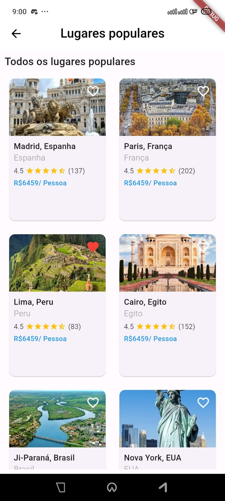

# 🌍 Tourism Guide — Flutter & Dart  

💻 **Final project for the Mobile Programming course**  
📱 Application developed in **Flutter** with **Dart**, focused on presenting tourist destinations interactively.  

The system explores concepts such as:  
- 🎨 **UI development** with `StatelessWidget` and `StatefulWidget`  
- 🔄 **State management** (`setState`, `Provider`)  
- 📝 **Forms and validation**  
- 🌐 **API consumption** (HTTP GET/POST requests)  
- 🗄️ **Data persistence** with **SQLite (sqflite)**  
- 🎯 **Prototyping in Figma**  
- 🧩 **Reusable widget components**  

---

## 🚀 Project Goal  
The **Tourism Guide** aims to provide quick and organized information about popular tourist destinations, allowing the user to:  
- Explore the most visited destinations.  
- View details with photos, location, reviews, and prices.  
- Access locally saved data through a database.  
- Interact with a clean and user-friendly interface.  

---

## 📂 Screens (Pages)  

### 🔑 **LoginPage**  
- First screen of the app.  
- Form with custom input fields (`CustomTextField`) and a styled button (`CustomButton`).  
- Goal: authenticate or simulate user access.  

---

### 🏠 **HomePage**  
- Main screen after login.  
- Components:  
  - Top bar with **profile picture + name**.  
  - Notifications (interactive icon).  
  - **"Best Destination"** section with carousel.  
- Goal: serve as navigation hub for destinations.  

---

### 🎡 **IntegradoCarrosel**  
- Image carousel screen.  
- Displays featured destinations interactively.  

---

### 🏰 **DetalhesMadriPage**  
- Detailed information about **Madrid (Spain)**.  
- Components:  
  - Highlight image.  
  - Destination name, location, and reviews.  
  - Additional image carousel.  
  - Description text.  
  - **“Book now”** button.  

---

### 🗼 **DetalhesParisPage**  
- Same structure as Madrid’s detail page, but for **Paris (France)**.  
- Includes photos, price, reviews, and booking button.  

---

### 📍 **LugaresPopularesPage**  
- List with other registered tourist destinations.  
- Data comes from **SQLite (DataBaseTurismo)**.  

---

### 👤 **PerfilPage**  
- Displays user profile information.  
- Can be expanded to allow profile editing.  

---

### 💬 **MensagensPage**  
- Screen for notifications or app messages.  
- Goal: provide communication and reminders for the user.  

---

## 🗄️ Local Database — SQLite  
File: `database_turismo.dart`  
- Table: **places**  
- Fields: `id`, `name`, `location`, `reviews`  
- Initial data: Madrid, Paris, Lima, Cairo, Ji-Paraná, and New York.  
- Functions: **insert**, **queryAllPlaces**, **updatePlace**.  

---

## 🧩 Reusable Components  
- **CustomButton**: styled button with full width and rounded borders.  
- **CustomTextField**: custom text field with password support (`obscureText`).  

---

## 📸 Screenshots  

| Login | Home 1 | Home 2 |
|-------|--------|--------|
|  |  |  |

| Carousel 1 | Carousel 2 | Carousel 3 |
|------------|------------|------------|
|  |  |  |

| Details Madrid | Details Paris | Profile |
|----------------|---------------|---------|
|  |  |  |

| Messages | Popular Places 1 | Popular Places 2 |
|----------|------------------|------------------|
|  |  |  |

| Popular Places 3 |
|------------------|
|  |

---

## ⚙️ Technologies Used  
- [Flutter](https://flutter.dev/)  
- [Dart](https://dart.dev/)  
- [Sqflite](https://pub.dev/packages/sqflite) (SQLite persistence)  
- [Path](https://pub.dev/packages/path) (SQLite path support)  
- [Figma]([https://figma.com](https://www.figma.com/design/yBCbUBrCBgo5NltkglMohg/Modelo-atividade-3-Mobile?node-id=0-1&p=f&t=71YmrctHvPritJfp-0)) (UI prototyping)  

---

## 👨‍💻 Authors  
**Wasgton Gomes**  
**Leonardo Rocha**  

Mobile Programming Course — Web Programming Discipline  
Analysis and Systems Development Course — IFRO - Campus Ji-Paraná
